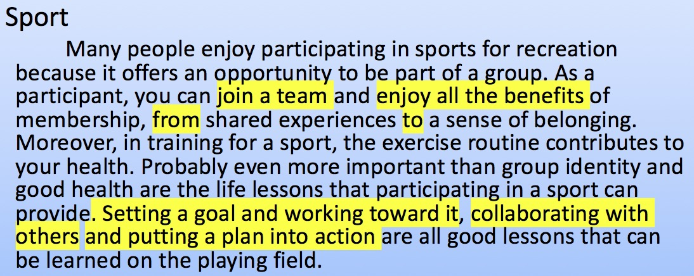
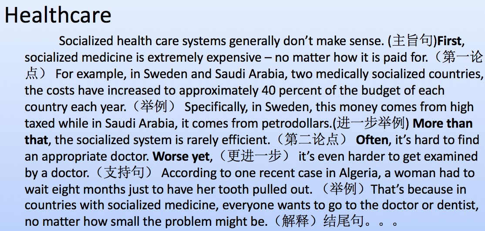
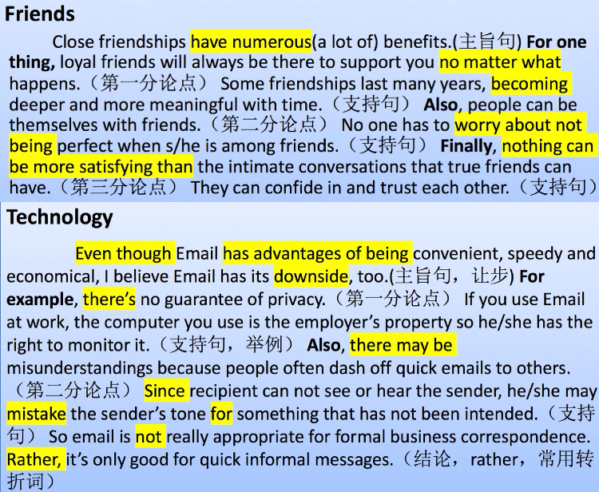

## 2019-02-10

主旨句，带上原因的归纳总结。

为什么吃苹果，苹果可以补充有益健康。下面细节，都在阐述如何补充水分

过空和过细，倾向细

all the benefits of ... 后面一般就要举例子了，那么from …… to …… / SUCH AS
benefits 就会提到改观，所以from……to……搭配合适

第一段黄色标注内容，动词连用

生词 |  句式 
------------ | -------------
**第一段范例** |
recreation 休闲 = entertainment 题目中会出现 | participant in = take part in 参加
a sense of belonging 归属感 | from …… to …… 替代 such as ，举例，而不是并列的罗列
routine 每天重复做的事情 daily/excess routine | contribute to 因果关系，非常好的词
even more比……更重要的 | life lessions 人生的课程
collaborate with 分工协作 | cooperate with 合作
set a goal 设定目标 | put ... into action 把……付诸行动
**第二段范例** |
health care 医保 | sociallized medicine 公费医疗，社保
don't make sense 不合理的，否定前面说的 | rarely 几乎不，否定，副词 与little不同，little形容词
approriate 合适的 | worse yet 更糟糕的是，非常好的递进词；better yet更好的是
examine 检查，physical examine 体检 | dentist牙医

## 2019-01-10

婴幼儿百科全书，有图有
科学杂志 小孩子
意思联想不到语感

坚持半年
图书馆

1. 听

听力3-4小时，沉浸式，按照自己水平，听懂70-80%，难度逐步增加
先听3-4遍，实在听不懂，看文本，当做阅读来做

2. 多看多读

不做多读，生词画下来，先不查词，量先上来，再去查，单位时间看文章速度提升
从最最基础的，外国幼儿园，小学

3. 写作
看范文开始做起

----

写作

1 模仿

生词 |  句式 
------------ | -------------
**第一段范例** |
numerous | no matter what
-| 句子, becoming ...
-| worring about not being ...
-| nothing can be more satisfying than ...
-| For one thing,... Also, ...
**第二段范例** | 
downside | Even though
guarantee | have advantage of being ...
recipient | 高级句式 a, b and c ...
correspondes | There be ...
formal | Since ...
dash off 草草地写 | mistake ... for ...
intend | ... not ... . Rather, ...

并列结构，并2个点

**Some people prefer to live in a small town. Others prefer to live in a big city. Which place would you prefer to live in?**

I prefer to live in a big city. For one thing, the big city has numerous {--convienct 拼错--} {++convenient++} {--traffic--} {++public transportation++}. It will support everyone no matter {--what--} {++where++} you want to go. Also, There are a lot of convience in the big city. No one has to worry about to buy.
