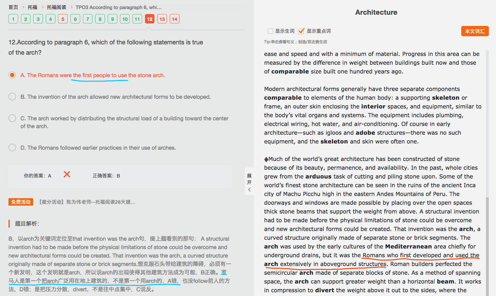
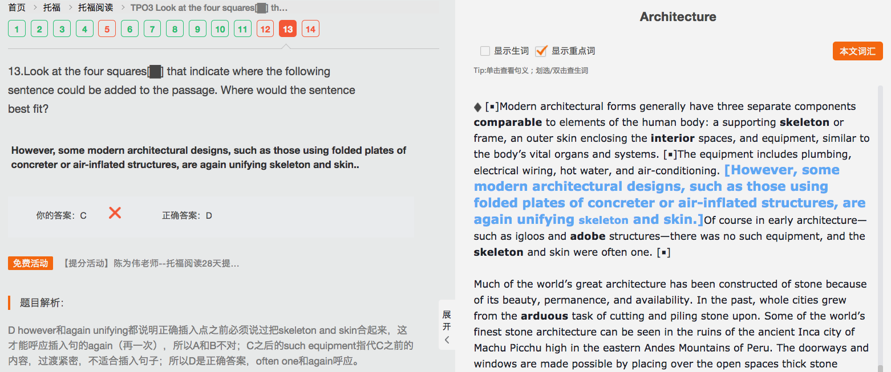
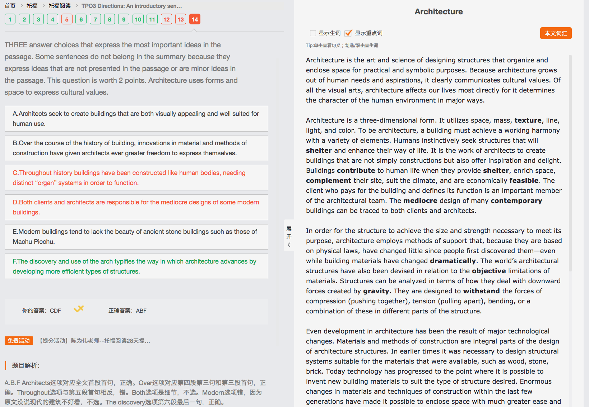

<h3>Architecture    10/14</h3>

*（主旨：建筑的目的、原因）*Architecture is the art and science of (designing) structures (that organize and enclose space) for practical and symbolic purposes. Because architecture grows out of human needs and aspirations, it clearly communicates cultural values. **||** Of all the visual arts, architecture affects our lives most directly (for it determines the character of the human environment in major ways).*（用具体作用和影响呼应开头）*

*（主旨：定义建筑）*Architecture is a three-dimensional form. It utilizes space, mass, texture, line, light, and color. To be architecture, a building must achieve a (working) harmony with a variety of elements. **||** Humans instinctively seek structures (that will shelter and enhance their way of life). It is the work of architects to create buildings (that are not simply constructions but also offer inspiration and delight). Buildings contribute to human life (when they provide shelter, enrich space, complement their site, suit the climate, and are economically feasible). *（细节：人类需求，设计师的作用）***||** The client (who pays for the building and defines its function) is an important member of the architectural team. The mediocre design of many contemporary buildings can be traced to both clients and architects.*（客户的作用，设计师与客户对建筑的影响）*

*（主旨：建筑方法）*In order for the structure (to achieve the size and strength necessary) to meet its purpose, architecture employs methods of support that, (because they are based on physical laws), have changed little (since people first discovered them)—(even while building materials have changed dramatically). **||** The world’s architectural structures have also been devised in relation to the objective limitations of materials.*（细节：材料限制的设计考虑）* Structures can be analyzed in terms (of how they deal with downward forces (created by gravity)). They are designed to withstand the forces of compression (pushing together), tension (pulling apart), bending, or a combination of these in different parts of the structure.*（细节：力学因素和设计考虑）*

*（主旨：技术带来发展，引出材料和方法）*Even development in architecture has been the result of major technological changes. Materials and methods of construction are integral parts of the design of architecture structures. **||** In earlier times it was necessary to design structural systems suitable for the materials (that were available), (such as wood, stone, brick).  Today technology has progressed to the point (where it is possible to invent new building materials to suit the type of structure (desired)).*（细节：今夕对比，发明新材料）* **||** **Enormous changes in materials and techniques of construction within the last few generations have made it possible to enclose space with much greater ease and speed and with a minimum of material.** （问题：好多with连着的时候不太会看）Progress in this area can be measured by the difference in weight between buildings built now and those of comparable size built one hundred years ago.*（细节：材料和技术的发展，发展可测量）*

*（主旨：提出与人身体相似元素）*Modern architectural forms generally have three separate components comparable to elements of the human body: a (supporting) skeleton or frame, an outer skin (enclosing the interior spaces), and equipment, similar to the body’s vital organs and systems. The equipment includes plumbing, electrical wiring, hot water, and air-conditioning. *（细节：用equipment举例）* Of course in early architecture—(such as igloos and adobe structures)—there was no such equipment, and the skeleton and skin were often one. *（细节：今夕对比，补充说明）*

*（主旨：用石头建造引出新结构发明）*Much of the world's great architecture has been constructed of stone (because of its beauty, permanence, and availability). **||** In the past, whole cities grew from the arduous task of cutting and piling stone upon.  Some of the world's finest stone architecture can be seen in the ruins of the ancient Inca city of Machu Picchu high in the eastern Andes Mountains of Peru. The doorways and windows are made possible by placing over the open spaces thick stone beams (that support the weight from above).*（细节：顺承递进，说门窗结构）* **||** A structural invention had to be made (before the physical limitations of stone could be overcome and new architectural forms could be created).*（转折：新发明）* That invention was the arch, a curved structure originally made of separate stone or brick segments.*（新结构构成元素）* The arch was used by the early cultures of the Mediterranean area chiefly for underground drains, but it was the Romans (who first developed and used the arch extensively in aboveground structures). Roman builders perfected the semicircular arch made of separate blocks of stone.*（细节：罗马人最先开发和使用）* As a method of spanning space, the arch can support greater weight than a horizontal beam.*（细节：新结构与老结构对比的优势）* It works in compression to divert the weight above it out to the sides, (where the weight is borne by the vertical elements on either side of the arch).*（新结构原理）* The arch is among the many important structural breakthroughs (that have characterized architecture throughout the centuries).*（顺承递进，补充说明）*

----

