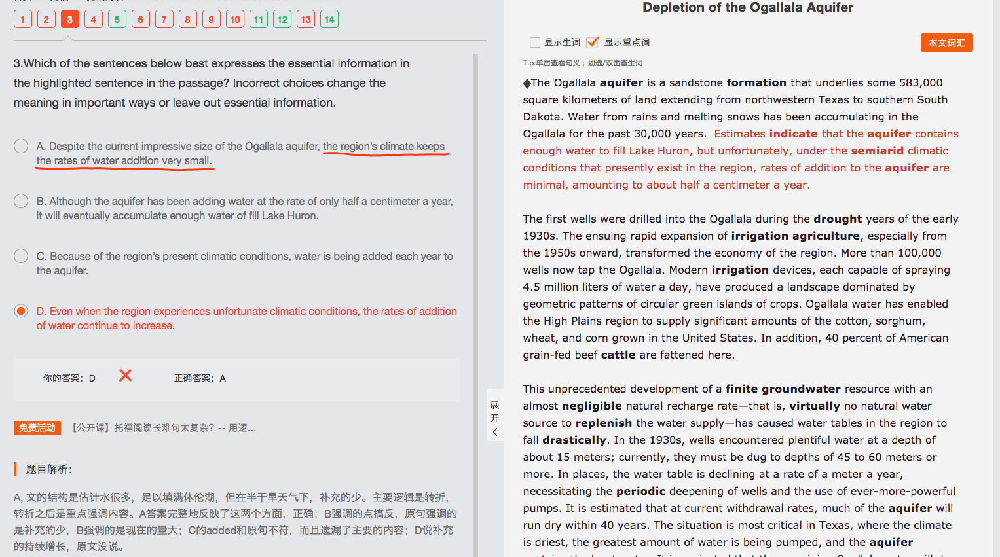

<h3>Depletion of the Ogallala Aquifer   4/14</h3>

*（主旨：引出Ogallala aquifer）*The vast grasslands of the High Plains in the central United States were settled by farmers and ranchers in the 1880s. This region has a semiarid climate, and for 50 years after its settlement, it supported a low-intensity agricultural economy of cattle ranching and wheat farming.*（顺承递进）* **||** In the early twentieth century, however, it was discovered (that much of the High Plains was underlain by a huge aquifer) (a rock layer containing large quantities of groundwater). This aquifer was named the Ogallala aquifer after the Ogallala Sioux Indians, (who once inhabited the region).*（顺承递进，用地区阐述Ogallala aquifer的出处）*

*（主旨：Ogallala aquifer的形成元素导致评估与实际有差异）*The Ogallala aquifer is a sandstone formation (that underlies some 583,000 square kilometers of land extending from northwestern Texas to southern South Dakota). **||** Water from rains and melting snows has been accumulating in the Ogallala for the past 30,000 years.*（细节：水的来源）* Estimates indicate (that the aquifer contains enough water to fill Lake Huron), but unfortunately, under the semiarid climatic conditions (that presently exist in the region), rates of addition to the aquifer are minimal, amounting to about half a centimeter a year.*（细节：评估与实际情况差异）*

The first wells were drilled into the Ogallala during the drought years of the early 1930s.*（细节1：提出第一口井）* The ensuing rapid expansion of irrigation agriculture, especially from the 1950s onward, transformed the economy of the region.*（细节2：提出灌溉发展）* More than 100,000 wells now tap the Ogallala.*（顺承递进1-2细节的联系：灌溉发展，井多）* **||** Modern irrigation devices, each capable of spraying 4.5 million liters of water a day, have produced a landscape (dominated by geometric patterns of circular green islands of crops). *（细节3：设备浇灌能力做铺垫）*Ogallala water has enabled the High Plains region to supply significant amounts of the cotton, sorghum, wheat, and corn grown in the United States. *（细节4：Ogallala water能支持细节3的需求）*In addition, 40 percent of American grain-fed beef cattle are fattened here.*（补充说明）*

This unprecedented development of a finite groundwater resource with an almost negligible natural recharge rate—(that is, virtually no natural water source to replenish the water supply)—has caused water tables in the region to fall drastically. **||** In the 1930s, wells encountered plentiful water at a depth of about 15 meters; currently, they must be dug to depths of 45 to 60 meters or more. In places, **the water table is declining at a rate of a meter a year, (necessitating) the periodic deepening of wells and the use of ever-more-powerful pumps.**（问题：deepening这个ing形式没看懂是什么成分——the periodic deepening是一个名词成分，A of B） **It is estimated (that at current withdrawal rates, much of the aquifer will run dry within 40 years）.**（问题：这句是强调句么？——不是！是It形式主语，that后面到结尾都是从句内容）The situation is most critical in Texas, (where the climate is driest), the greatest amount of water is being pumped, and the aquifer contains the least water. It is projected (that the remaining Ogallala water will), by the year 2030, support only 35 to 40 percent of the irrigated acreage in Texas (that is supported in 1980).*（顺承递进，举例支持）*

*（主旨：农民对Ogallala不同的必然损耗的不同反应）*The reaction of farmers to the inevitable depletion of the Ogallala varies. Many have been attempting to conserve water by irrigating less frequently or by switching to crops (that require less water). *（顺承递进：举例说明1）*Others, however, **have adopted the philosophy (that it is best to use the water (while it is still economically profitable to do so) and to concentrate on high-value crops such as cotton).**（问题：to do so => best to use?）*（顺承递进：举例说明2）***The incentive of the farmers (who wish to conserve water) is reduced by their knowledge (that many of their neighbors are profiting by using great amounts of water, and in the process are drawing down the entire region's water supplies).**（问题1：and与谁并列，and应该是定从中的并列对吧， are profiting和are drawing down；问题2：没看懂这句与前面的句间关系，怎么有种转折的意思？意思开始农民们想省水，结果由于邻居的过度浪费，减少了省水的动力？）

*（主旨：水资源危机，方案，结论）*In the face of the upcoming water supply crisis, a number of grandiose schemes have been developed to transport vast quantities of water by canal or pipeline from the Mississippi, the Missouri, or the Arkansas rivers.*（提出解决方案）* **||** Unfortunately, **the cost of water (obtained through any of these schemes) would increase pumping costs at least tenfold, making the cost of irrigated agricultural products from the region uncompetitive on the national and international markets.**（问题：making是与前面的pumping并列么？——不是并列，SVO，doing做结果状语——自己去看长难句！！！） *（转折：成本问题）* **||** Somewhat more promising have been recent experiments for releasing capillary water (water in the soil) above the water table by injecting (compressed) air into the ground. Even if this process proves successful, however, it would almost triple water costs. Genetic engineering also may provide a partial solution, as new strains of drought-resistant crops continue to be developed. *（转折：新品种研发）* **||** Whatever the final answer to the water crisis may be, it is evident (that within the High Plains), irrigation water will never again be the abundant, inexpensive resource it was during the agricultural boom years of the mid-twentieth century.*（结论：不论什么方案，水资源危机都会到来）*

----

那是Small！！！对应minimal！！！看清楚！！！