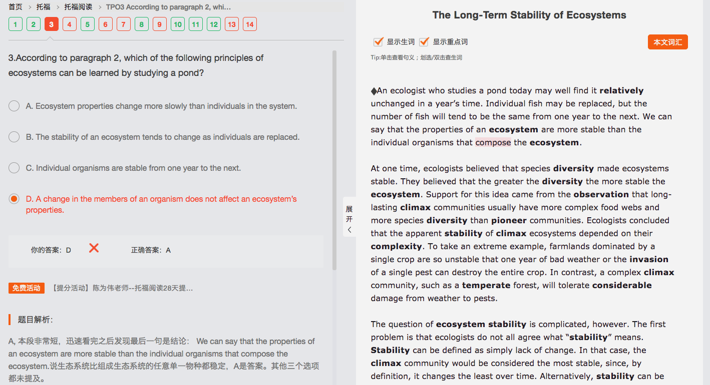
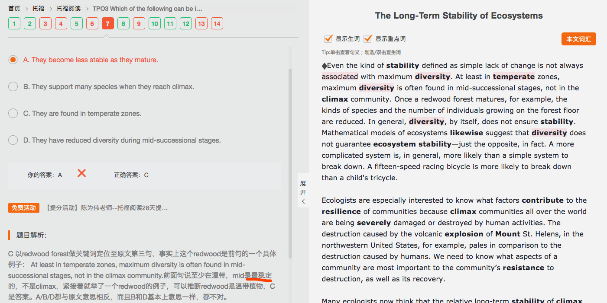
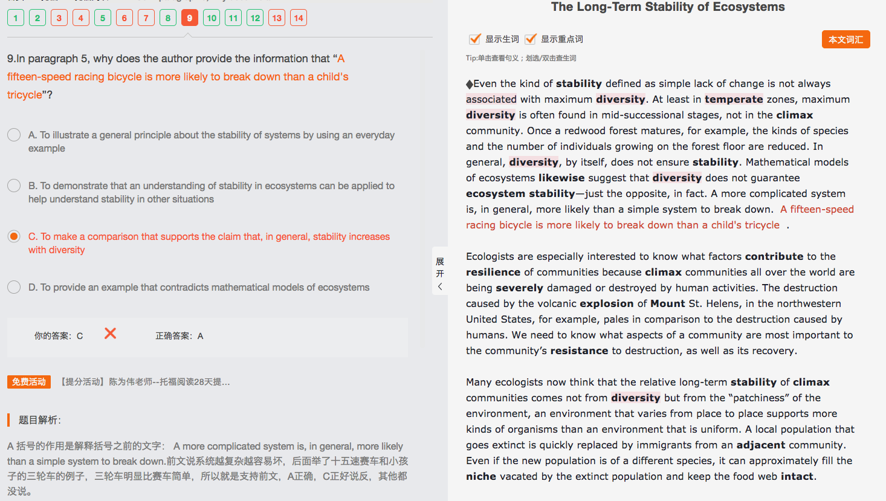
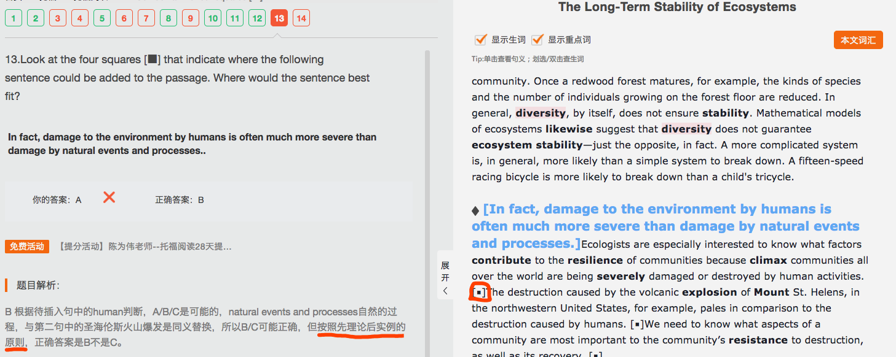

<h3>The Long-Term Stability of Ecosystems   7/14</h3>

*主旨：植物群体特别的结构依赖于地区的特殊历史* Plant communities assemble themselves flexibly, and their particular structure depends on the specific history of the area. **||** Ecologists use the term “succession” to refer to the changes (that happen in plant communities and ecosystems over time). The first community in a succession is called a pioneer community, while the long-lived community at the end of succession is called a climax community.  *（介绍term和2个群体）***||** Pioneer and successional plant communities are said to change over periods from 1 to 500 years. These changes—in plant numbers and the mix of species—are cumulative. Climax communities themselves change but over periods of time greater than about 500 years. *（2个群体的改变时长特征）*

*（主旨：存在不变的情况，池塘）*An ecologist who studies a pond today may well find it relatively unchanged in a year's time. Individual fish may be replaced, but the number of fish will tend to be the same from one year to the next. *（顺承递进，用鱼举例）***||** We can say (that the properties of an ecosystem are more stable than the individual organisms (that compose the ecosystem)).*（学术总结呼应第一句）*

*（主旨：多样性使得生态系统稳定，且越多样越稳定）*At one time, ecologists believed (that species diversity made ecosystems stable). They believed (that the greater the diversity the more stable the ecosystem). Support for this idea (came from the observation (that long-lasting climax communities usually have more complex food webs and more species diversity than pioneer communities)).*（顺承递进）* Ecologists concluded (that the apparent stability of climax ecosystems depended on their complexity).*（顺承递进，专家结论支持观点，准备举例）* To take an extreme example, farmlands (dominated by a single crop) are so unstable (that one year of bad weather or the invasion of a single pest can destroy the entire crop). In contrast, a complex climax community, (such as a temperate forest), will tolerate considerable damage from weather to pests.*（顺承递进，举极端例子说明）*

*（主旨：稳定性问题，稳定性意义的争议）*The question of ecosystem stability is complicated, however. The first problem is (that ecologists do not all agree what “stability” means). **||** Stability can be defined as simply lack of change. In that case, the climax community would be considered the most stable, since, by definition, it changes the least over time. *（举例，按照变化维度）* **||** Alternatively, **stability can be defined as the speed (with which an ecosystem returns to a particular form (following a major disturbance)), (such as a fire). **[稳定性也可以界定为生态系统在经历了严重破坏之后回复原貌的速度，比如火灾。]（speed的定语从句没看懂，为什么是with which？——which用speed替代，with speed放在句尾）This kind of stability is also called resilience. In that case, climax communities would be the most fragile and the least stable, since they can require hundreds of years to return to the climax state.*（举例，按照速度维度）（通过以上两个维度分析，证明主旨同一个群体稳定性定义不同）*

*（顺承递进上段，主旨：变化维度与多样性关系，与第二段主旨反）*Even the kind of stability defined as simple lack of change is not always associated with maximum diversity. At least in temperate zones, maximum diversity is often found in mid-successional stages, not in the climax community.*（学术阐述）*Once a redwood forest matures, for example, the kinds of species and the number of individuals growing on the forest floor are reduced. *（举例说明）*In general, diversity, by itself, does not ensure stability.*（结论）*Mathematical models of ecosystems likewise suggest (that diversity does not guarantee ecosystem stability)—just the opposite, in fact. *（科学依据）*（为什么这里说实际上正相反？——按结构理解句子，与实际无关，opposite指对第二段越多样性越稳定而言的对立面）A more complicated system is, in general, more likely than a simple system to break down. *（学术总结）*A fifteen-speed racing bicycle is more likely to break down than a child's tricycle.*（举例补充说明）*

*（主旨：提出问题，恢复力元素是什么）*Ecologists are especially interested to know (what factors contribute to the resilience of communities) (because climax communities all over the world are being severely damaged or destroyed by human activities). The destruction caused by the volcanic explosion of Mount St. Helens, in the northwestern United States, for example, pales in comparison to the destruction caused by humans.*（次要信息，用人类毁坏了强阐述被毁坏的很严重，不好恢复）*
We need to know (what aspects of a community are most important to the community's resistance to destruction, as well as its recovery). *（用重要性呼应第一句）*

*（主旨：稳定性不是来自多样性，而是环境的‘补缀’，回答上段问题）*Many ecologists now think (that the relative long-term stability of climax communities comes not from diversity but from the “patchiness” of the environment), an environment (that varies from place to place) supports more kinds of organisms than an environment (that is uniform). A local population (that goes extinct) is quickly replaced by immigrants from an adjacent community. Even if the new population is of a different species, it can approximately fill the niche (vacated by the extinct population) and keep the food web intact.*（举例说明）*

----

第四项没有说不会影响生态系统，都撕掉了或者，比如redforest突然变多，也会影响

第一项稳定的，改变时间慢

