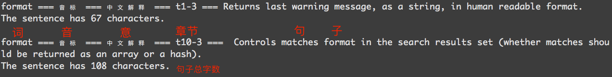

### 项目需求

- 根据词汇从阅读文章中搜索该词所在位置，并摘取出单词所在的完整句子。

- v1.0 结果导出为csv文件

### 准备工作 

- 词汇表.csv文件 By 老师

    !!! notice
        
        以下文本均为csv或者txt文件，每个字段使用英文双引号包围（如：=="== hello =="==），使用英文逗号作为字段间分隔符（如："hello" ==,== "你好"）。
        
        <font color='red'>注：文本请使用自然换行，且文本设置为UTF-8字符集。</font>

    > 格式如下：一个单词一行
    
    ```    
    "hello","音标","中文解释"
    "world","音标","中文解释"
    "China","音标","中文解释"
    ...
    ```

- 文章.csv文件 By 老师

    > 注：一个文章一行，第二个文章另起一行。同一篇文章内容 ==不可== 换行
    
    ```
    <!--我是文章一，我是注释忽略我--> "章节","hello world China.hello world China.hello world China.hello world China.hello world China.hello world China.hello world China.hello world China.hello world China.hello world China.hello world China.hello world China.hello world China.hello world China.hello world China.hello world China.hello world China.hello world China.hello world China.hello world China."
    <!--我是文章二，我是注释忽略我--> "章节","abcdefghigklmnopqrstuvwxyz.abcdefghigklmnopqrstuvwxyz.abcdefghigklmnopqrstuvwxyz.abcdefghigklmnopqrstuvwxyz.abcdefghigklmnopqrstuvwxyz.abcdefghigklmnopqrstuvwxyz.abcdefghigklmnopqrstuvwxyz.abcdefghigklmnopqrstuvwxyz."
    <!--我是后续文章，我是注释忽略我--> "章节","文章内容"
    ```

- 结果样式参考 By 乔婧

     
    

### 研发 

- 开发程序 By 乔婧

    - [x] 技术选型
    
    - [x] 初步验证，达到效果
    
    - [ ] 完整性开发 

- 将文章文件导入数据库 By 乔婧

    - [x] 数据库环境

- 运行程序出结果 By 乔婧

    - [x] 程序部署与运行环境

###

### 项目验收

老师