### Policy

**45s Reading 100 words {++take notes++}**

- Reading ( 1 + 2 ) 抓标题，抓观点，抓理由/优点
    - uni: 1 policy / announcement ==**+**== 2 reasons / 1 reason + 1 point
    - proposal : 2 points

**2 students conversation 60s {++take notes++}  ==+==  30s {++prepare++}**

- Listening ( M[he] / W[she] --> 主角 / 配角 )
    - 意见: agree / disagree
        - reason 1: detail
        - reason 2: detail
    
**60s Answer ( 20s R + 40s L )**

- Speaking 转述 Template

    > **Reading**
    
    > THE UNIVERSITY ANNOUNCES / A STUDENT PROPOSES THAT {++reading policy / annoucement++}. BECAUSE {++reading reason 1++} AND  {++reading reason 2++} / MOREOVER {++reading point 1++}. 

    > **Listening**
    
    > IN THE LISTENING / CONVERSATION, THE BOY / GIRL / THE MAN / WOMAN AGREES / DISAGREES WITH THIS. FIRST OF ALL, {++listening reason 1++}.{++listening detail 1++}. SECOND / WHAT'S MORE, {++listening reason 2++}.{++listening detail 2++}.

### 2018-06-04

??? info "**TPO2  Bus Service Elimination Planned （公交服务被计划取消）**"

    ==**Reading**==
    
    The university has decided to discontinue its free bus service for students. （大学决定对学生们停止免费公交服务。）
    
    The reason given for this decision is that few students ride the buses and the buses arc expensive to operate. （这个决定的原因是只有少部分学生乘坐公交并且公交使用费用昂贵。）
    
    Currently, the buses run from the center of campus past university buildings and through some of the neighborhoods surrounding the campus. （当前，这个公交从校园中间出发途径教学楼和一些邻近校园的社区。）
    
     The money saved by eliminating the bus service will be used to expand the overcrowded student parking lots. （通过消除公交服务节省下来的钱可以用来大量扩张过度拥挤的学生公园。）
    
     ==**Listening**==
    
     Man:I don't like the university's plan. （我不喜欢学校的计划）
    
     Woman:Really? I've ridden those buses, and sometimes there were only a few people on the bus. It did seem like kind of a waste.（真的？我坐过那些公交，并且有时只有几个人在车上。这个看起来是各种浪费。）
    
    Man:I see your point. （我明白你的意思。）But I think the problem is the route's out-of-date.（但是我认为路线更新是一个问题） It only goes through the neighborhoods 【that've gotten too expensive for students to live in】. （它只经过由于太贵而学生无法入住的社区。）It's ridiculous that they haven't already changed the route - you know, so it goes where most of campus students live now.（可笑的是他们并没有改变路线——你知道，所以这个路线是现在大多数校园学生居住的地方。） I bet if they did that, they'd get plenty of students riding those buses.（我敢肯定，会有很多学生坐那些公交。）
    
     Woman:Well, at least they are adding more parking. It's gotten really tough to find a space.（至少可以增加公园面积。找到一块空地确实很困难。）
    
     Man:That's the other part I don't like, actually. （实际上，那是我不喜欢的另一个方面。）Cutting back the bus service and adding parking's just gonna encourage more students to drive on campus.（削减公交服务和增加公园面积只会激发更多的学生在校园里开车） And that'll just add to the noise around campus and create more traffic...and that'll increase the need for more parking spaces.（并且这只会在校园周围增加噪音和制造更多的交通事故。。。并且这将更加增加对公园空地的需求。）
    
     Woman:Yeah, I guess I can see your point. （是的，我想我明白你的意思。）Maybe it would be better if more students used the buses instead of driving.（也许更多的学生使用公交替代开车看来了更好。）
    
     Man:Right. And the university should make it easier to do that, not harder.（是的。并且学校做这件事应该更简单，并不难。）
    
     ==**Speak**==
    
     `听力部分录音`
    
    !!! note
 

### 2018-06-05

??? info "**TPO3 Hot Breakfasts Eliminated （热早餐被取消）**"

    ==**Reading**==
    
    Beginning next month, Dining Services will no longer serve hot breakfast foods at university dining halls. （从下个月开始，学校餐厅不再提供热早餐。）
    
    Instead, students will be offered a wide assortment of cold breakfast items in the morning. （取而代之，早上会提供给学生们各种各样的冷早餐内容。）
    
    These cold breakfast foods, such as breads, fruit, and yogurt, are healthier than many of the hot breakfast items that we will stop serving, so health-conscious students should welcome this change. （这些冷早餐，诸如面包、水果和酸奶，要比很多热将要停止提供的早餐要健康，因此有健康意识的学识应该乐于接受这个改变。）
    
    Students will benefit in another way as well, because limiting the breakfast selection to cold food items will save money and allow us to keep our meal plans affordable.（学生们将同样受益于另一种方式，因为有限制的早餐选择为冷早餐可以节省钱并能使我们保持我们的餐供应计划。）
    
     ==**Listening**==
    
     (woman) Do you believe any of this? It's ridiculous.（你信这些吗？真可笑。）
    
    (man) What do you mean? It is important to eat healthy foods.（你什么意思？吃健康食品很重要。）
    
    (woman) Sure it is! （确实！）
    
    But they are saying a yogurt is better for you than an omelet or than hot cereal? （但是他们说一个酸奶比煎蛋或热麦片对你更好？）
    
    I mean, whether something is hot or cold, that shouldn't be the issue. （我的意思，不论是热的还是冷的，这都不应该是问题。）
    
    Let's say maybe on a cold morning, in that case, which is going to be better for you, a bowl of cold cereal or a nice warm omelet? （也许在冷的早餐，在这个例子中，哪个对你更好，一碗冷麦片还是一个很好的热煎蛋？）
    
    It's obvious. （很明显。）There's no question.（毫无疑问。）
    
    (man) I'm not gonna argue with you there.（我不和你争论。）
    
    (woman) And this whole thing about saving money.（并且这些所有关于省钱。）
    
    (man) What about it?（关于什么？）
    
    (woman) Well, they are actually going to make things worse for us, not better. （实际上是给我们一些更差的，而不是更好的。）
    
    Cause if they start to cutting back and we can't get what we want here on campus, well, we are going to going off campus and pay off-campus prices. （因为如果消减并且我们无法得到我们在校园想得到的东西，我们就要走出校园并且支付校园外的价格。）
    
    And you know what? （你知道这意味着什么？）That'll be expensive. （将是更贵。）
    
    Even if it's only two or three mornings a week, it can add up.（即使每周只两或三天，也增加了（开销）。）
    
     ==**Speak**==
    
     `Well, the woman disagrees with the announcement for two main reasons. For one thing she believes that students will need hot food from time to time. For example on cold mornings students will need hot food like hot cereal more than cold food like yogurt. Secondly she argues that the students will go off-campus to pay more prices to get what they want due to the cutting back of meals. As a result the cost will actually add up and is therefore a worse situation for the students. All in all, the woman disagrees with the announcement for the reasons stated above.`
    
    !!! note
        add up 增加，累积
    
        Even if it's only two or three mornings a week, it can add up.（即使每周只两或三天，也增加了（开销）。）

### 2018-06-06

??? info "**TPO 4 Evening Computer Classes May Be Added （可能要增加计算机晚课）**"

    ==**Reading**==
    
    The computer department is considering offering evening classes in the fall. （计算机部门正考虑在秋天提供晚课）
    
    The proposal to add the classes is a response to student complaints that daytime computer classes have become increasingly overcrowded and there are no longer enough computers available.（ 这个增加课程的提议是响应学生的日间计算机课看起来越来越拥挤的抱怨和不再有足够的计算机可使用。）
    
    The department has decided that despite some added expense, the most cost-effective way of addressing this problem is by adding computer classes in the evening. （部门决定尽管增加一些费用，解决这些麻烦的最大的性价比方法是晚上添加计算机课。）
    
    It is hoped that this change will decrease the number of students enrolled in day classes and thus guarantee individual access to computers for all students in computer classes.  （这个改变希望减少这些数量的学生注册日间课并且因此保证所有学生在计算机课上有个人的计算机使用权。）
    
    ==**Listening**==
    
    man) I just don't think this will work.（我只觉得这些不能起作用。）
    
    woman) Why not?（为什么不？）
    
    man) Because it's not gonna solve the problem. （因为这解决不了问题。）
    
    Students are busy at night, I mean, we have jobs, families, clubs, social events. （学生们在晚上非常忙，我们有工作，家庭，俱乐部，社会活动。）
    
    Most of us already have something to do every single night of the week.（我们的大部分一周的每个夜晚都有事情要做。）
    
    woman) I see your point. （我明白你的意思。）
    
     sure couldn't fit anything into my schedule during the week. （我确实不能向我一周的时间表加入任何事。）
    
    I've got swimming practice most nights.（我在大多数的晚上会去练习游泳。）
    
    man) Right! And as far as expense goes, I think they're going about it the wrong way. （是的！并且一直花钱，我认为这是个错误的方法。）
    
     I mean, it cost money to hire more teachers and keep the academic building open later, which is a lot more expensive than simply just buying more computers.（我的意思，花钱去雇佣更多的老师和延长学院大楼的开放时间，这个要比简单的只购买更多的计算机要贵的非常多。）
    
    woman) More computers?（更多的计算机？）
    
    man) That's right! Computer prices have come way down the past few years. （是的！计算机价钱近几年降价了。）
    
    So the department won't have to spend as much now as they did in the past. （所以部门不用必须现在像以前一样花那么钱。）
    
    Besides, the computer department classrooms, you know, the rooms themselves, they are actually very big, there’s plenty of space to add more computers.（除此之外，计算机部门教室，你知道，教室本身，实际上非常大，有大量的空间去增加更多的计算机。）
    
    ==**Speak**==
    
    `The  computer department announces that they will add evening computer classes for students. Because students complains that the daytime classes is increasingly overcrowded and there are no longer enough computers available.
    In the listening, the man disagrees with this. First of all, students are very busy at night, they have jobs, families, clubs, and social events. They already have something to do every single night of the week. They cound't fit anything into their schedule during the week. Second, It cost money to fire more teachers and keep academic building open later, which is more expensive than buying more computers. And the department rooms are very big, there's a plenty of space to add more computers.`
    
    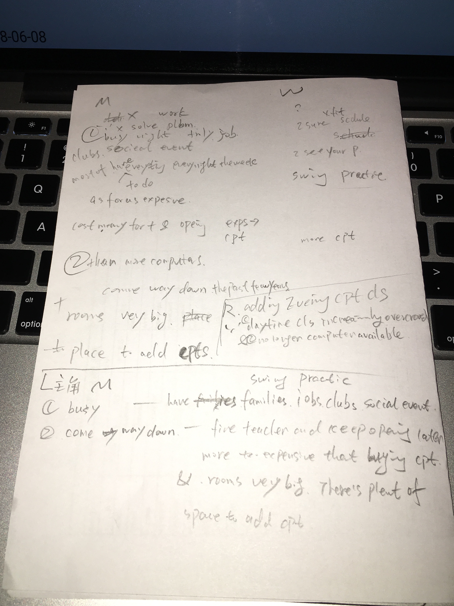
    
    !!! note
    
### 2018-06-08

??? info "**TPO 5 Campus Dining Club Announced（宣布校园餐厅俱乐部）**"

    ==**Reading**==
    
    Starting this year, the university dining hall will be transformed into The Campus Dining Club for one week at the end of each semester. （从这年开始，每个学期的最后一周，学校餐厅会转变为校园餐厅俱乐部。）
    
    During the last week of each semester, the dining hall will feature special meals prepared by the university’s culinary arts students. （在每个学期的最后一周期间，餐厅俱乐部会以特色肉，他们由学校烹饪艺术的学生准备。）
    
    The school feels that this will give students who are studying cooking and food preparation valuable experience that will help them later, when they pursue careers. （学校觉得这对学习烹饪和食物准备价值的学生有帮助，当他们就业的时候。）
    
    The university has announced that it will charge a small additional fee for these dinners in order to pay for the special gourmet food ingredients that will be required.（学校宣布将要花费小部分费用用于餐厅，为了支付需要的特殊美食食材。）

    ==**Listening**==
    
    (woman) Did you see that article?（你看到那个文章了么？）

    (man) Yeah, and it sounds like a great idea. It's really good for students in that program.（是的，听起来是个好消息。这个项目对学生真好。）
    
    (woman) Don't they cook in class anyway?（总之，他们在课上没烹饪过？）
    
    (man) Well, yeah, they do.（是的，他们没做过。） But, my cousin was in the program a few years ago, and she said that it's very different to cook for a lot of people in that kind of atmosphere than to cook for classmates.（但是，我妹几年前在这个项目里，并且她说给很多各种环境人做饭相比给同学们做饭有非常大的区别。）
    
    (woman) Why is that?（为什么？）
    
    (man) Well, in class you can take your time, but, cooking for more people, there's more pressure, I mean, you're in a rush, people are waiting and it might be easy to make a mistake with all that stress.（在课上，你可以控制时间，但是，为更多的人做饭会有更多的压力，我的意思，你在赶时间，人们等着并且你很容易在所有压力下出错。）
    
    (woman) Then I'll think you are a bad chef, right?（然后我就觉得你是个不好的厨师，对不？）
        
    (man) Absolutely!（绝对地！）
    
    (woman) So, OK, it's good practice. But what about the extra cost?（所以，好的，这是一个好的练习。但是额外的成本是什么？）
    
    (man) Well, look at it this way. You've eaten at some of the fancier restaurants in town, right?（看看这个方法。你在小镇吃了一些饲养类的餐厅，是不？）
    
    (woman) Yeah, there are some great places to eat around here.（是的，吃饭的周围有一些很大的空间。）
    
    (man) Well, these students, they’ll be making fantastic meals and it’s gonna be cheaper than going out to one of those restaurants.（这些学生，他们制作吸引人的肉并且比外出的餐厅之一要便宜很多。）
    
    (woman) Much cheaper, actually.（非常便宜，事实上。）
    
    (man) So, you know, it’ll be worth it. The meals will be as good as the ones in those expensive restaurants.（所以， 你知道，这个很值。这个肉和那些昂贵的餐厅一样好。）
    
    ==**Speak**==
    
    `The university {++ANNOUNCES THAT++}  they will transform the university dining hall into The Compus Dining Club for one week at end of each semester. {++BECAUSE++} they will privode sepical meals prepared by culinary arts students when they pursue carees {++AND++} charge a small additional fee for the special gourmet food ingredients. {++IN THE LISTENING++}, {++THE MAN++} agrees with this. {++FIRST OF ALL++}, the studens don't cook in class. It's very different to cook for a lot of people in that kind of atmosphere than to cook for classmates. Cooking for more people , you're in a rush, people are waiting and it might be easy to make a mistake with all that stress. {++SECOND++}, About the extra cost, these students  will be make fantastic meals and it's gonna be cheaper than going out to one of restaurants in town. So, the program will be worth it.`
        
    NEW WORDS |  NEW WORDS |  NEW WORDS
    ------------ | -------------  | -------------
    feature 以……为特色 | culinary 【正式】烹饪（用）的 | preparation 预备，准备
    pursue a career 就业 | gourmet 美食的 | ingredients 成分，食材
    cousin 弟兄姐妹 | atmosphere 气氛，环境 | kind of 各种
    be in a rush 赶时间 | chef 厨师 | look at  看看
    fancier ==fancy的比较级，更高级的== | ==fancy 【酒店、餐厅、汽车等】昂贵的，豪华的== | be worth sth 值……钱
    pressure 压力 | fantastic 极好的，吸引人的，有趣的
    
    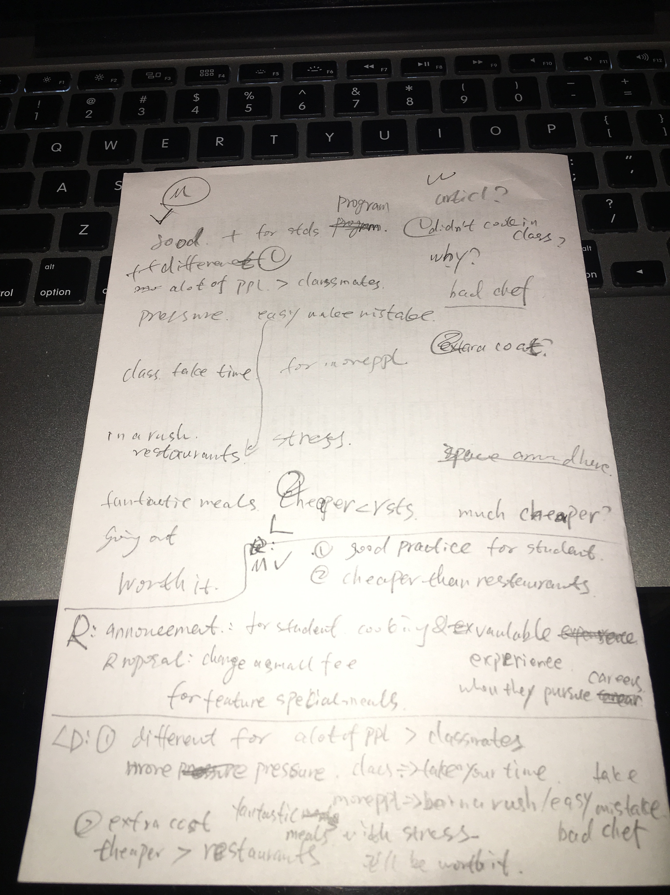
            
    !!! note "老师反馈"
        Reading：BECAUSE...AND...有问题，这里不是2个reason，应该是2个point
        
        > 不如改成：Moreover, the school claims to charge some extra fee for the ingredients.
        
        fancier restaurants 这里指高档餐厅
        
### 2018-06-09

??? info "**TPO 6 History Seminars Should Be Shorter（历史研讨班应该更短）**"

    ==**Reading**==
    
    Currently, all of the seminar classes in the history department are three hours long. （当前，历史部门的所有的研讨班课都时长3小时。）
    
    I would like to propose that history seminars be shortened to two hours. （我建议历史研讨班缩短到两个小时。）
    
    I make this proposal for two reasons. （我提出这个建议有两个原因。）
    
    First, most students just cannot concentrate for three hours straight. （第一，大多数学生不能专注持续3个小时）
    
    I myself have taken these three-hour seminars and found them tiring and sometimes boring. （我自己上过三小时的研讨班并且发现他们都是困倦和无聊的）
    
    Also, when a seminar lasts that long, people stop concentrating and stop learning, so the third hour of a three-hour seminar is a waste of everyone's time. （除此之外，在长研讨班最后阶段，人们不再专注也不再学习，因此3小时研讨班的第三小时是每个人时间的浪费。）
    
    Two-hour seminars would be much more efficient.（2小时研讨班效率会更高。）
    
    ==**Listening**==
    
    (woman) I totally disagree with Tim's proposal.（我完全不同意Tim的提议。）

    (man) Why?（为什么）
    
    (woman) Well, look, Tim's my friend but he's not your typical student. （听着，Tim是我的朋友，但是他不是你这样有代表性的学生。）
    
    He stays up late partying every night, week nights, too.（他每晚在聚会熬夜到很晚，周末晚上也是。）
    
    (man) If he parties every night no wonder he can't pay attention.（如果每晚聚会，没有奇迹的话，他不可能集中注意力。）
    
    (woman) Yes, and most students aren't like that. （是的，并且大多数学生不像他那样。）
    
    They come to class prepared and rested and they can concentrate.（他们有准备并且休息好来上课，并且他们能够集中注意力。）
    
    (man) So, you're saying that problem is really Tim.（所以，你说的是Tim的麻烦。）
    
    (woman) Yes. He was in one of my classes last year and whenever I looked at him he was actually sleeping.（是的，去年他是我们班的一员，无论什么时候我看他，他实际上在睡觉。）
    
    (man) I guess if he was sleeping, he can't really know what's happening, what other people in class are doing.（我想，如果他睡觉，他不可能知道发生了什么，其他人在课上做了什么。）
    
    (woman) Right! And you want to know what does happen in that last hour of seminar?（对！并且你想知道在历史研讨课的最后一个小时发生了什么么？）
    
     In a lot of seminars that I've been in, that's when things get interesting.（在我上过的大多数的历史研讨班，那是事情变得有趣的时候。）
    
    (man) Really?（真的？）
    
    (woman) Yes, that's usually when students get really involved in the discussion and start exchanging important ideas, and if the History department actually did what Tim suggests, well if they did that, what would happen is you’d lose what might be the most worthwhile part of the seminar.（是的，那会通常在学生得到参与讨论和开始交换重要观点的时候，并且如果历史部门实际上按Tim所建议的那样，好吧，如果他们这样做，将要所发生的是你会损失研讨班上可能更重要的部分。）
    
    ==**Speak**==
    
    `A STUDENT PROPOSES THAT he suggest the history seminars should be from three hours to two hours. BECAUSE students cannot pay attention for three hours straight AND the third hour is tiring and boring, so it's a waste. IN THE CONVERSATION, THE GIRL DISAGREES WITH THIS. FIRST OF ALL, Tim is not typical student. He stays up late partying every night, he can't pay attention. But most students aren't like that, they come to class prepared and rested and they can concentrate. WHAT'S MORE, Tim was in one of her classes last year and whenever she looked at him he was actually sleeping, so he can't know what's happening, what other people in class are doing. At the time, students get really involved in the discussion and start exchanging important ideas. If the History department actually did what Tim suggest, they would lose what might be the most worthwhile part of the seminar.`
    
    
    NEW WORDS |  NEW WORDS |  NEW WORDS
    ------------ | -------------  | -------------
    Seminar 研讨班 | concentrate  专注，专心，集中注意力v | straight 径直的
    tiring 令人困倦的 | boring  无聊的 | waste 浪费n
    wonder 奇迹n（no wonder 表达不出意外的话，正常情况下） | worthwhile 重要的，有益的，值得做的 | pay attention (to sb./sth.) （对某人/某事）注意
    get involved 参与 | stay up 熬夜
    
    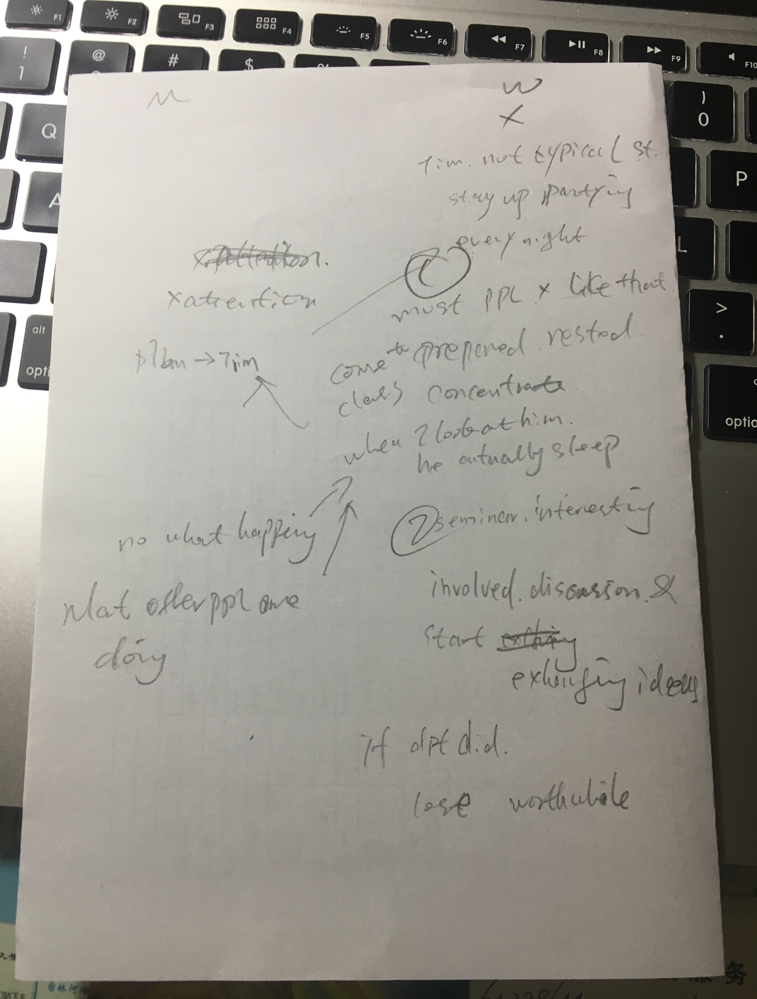    
    
    !!! note "老师反馈"   
    
### 2018-06-11

??? info "**TPO 7 Sculpture Courses to be Discontinued（雕塑课将停止）**"

    ==**Reading**==
    
    University administrators announced yesterday that the sculpture program, a division of the art department, will be eliminated. （学校管理员昨天宣布关于雕塑项目，艺术部门的一个部将被取消。）
    
    “The main reason is a lack of student interest,” reported one administrator. “（“主要原因是学生缺乏兴趣”，管理员报告说。）
    
    Although the number of art students has increased, fewer and fewer art major's are taking sculpture classes.” （尽管一些艺术学生有兴趣，但是更少的艺术主修课的学生是上雕塑课。）
    
    Furthermore, the department’s only sculpture professor is retiring this year. （此外，部门仅有的一个教授今年退休。）
    
    “Given the art department’s limited budget, the administrator explained, “It just doesn’t make sense to hire a new full-time professor to teacher sculpture for only a handful of students.”（“给艺术部门的预算是有限制的”，管理员解释说，“仅对少数学生去雇佣一个全职教授老教雕刻没有意义”）
    
    ==**Listening**==
    
    (man) Every thing all right?（真的？）

    (woman) Yeah, I'm just upset about that article I showed you this morning.（是的，我只是很生气，我早上给你看的这个条款。）
    
    (man) Why? What's the big deal?（为什么？什么大事？）
    
    (woman) Well, as an art major, I think it's a big loss for the department. The university's got it all wrong.（像艺术主修课，我想对于部门是一个损失。学校这样做是错误的。）
    
    (man) What do you mean?（你什么意思？）
    
    (woman) Well, the low enrolment isn't because art majors don't want to take these classes, problem is who has time to take them when there are so many other requirements?（并不是很少的上课人数，因为艺术主修课不想开这门课，问题是在很多其他要求的时候，谁有时间去上这课。）
    
    (man) I don't understand.（我没懂。）
    
    (woman) See, the classes they're eliminating are all optional. （他们取消的这些课都是选修课。）
    
    The required courses are mostly painting and drawing, and they take up all our time. （必修课主要内容是油画和素描，并且他们占用我们所有的时间。）
    
    What we really need are different requirements. （我们需要的是不同的需求。）
    
    Then art majors could take a better variety of classes, all the things we're interested in.（然后艺术主修课可以办的更多样化，所有事我们都感兴趣。）
    
    (man) That makes sense. But the thing about the professor…（有意义。但是这事关于教授。。。）
    
    (woman) Well, that's true. But still, they're being drastic. （是的。但是仍然，他们是突然的。）
    
    If money is the problem, they could hire a part-time professor. Or most of the professors in the department have secondary fields.（如果钱是问题，他们可以雇佣兼职教授。或者部门中的大多数教授都有第二领域。）
    
    (man) Really?（真的？）
    
    (woman) Yeah! At least a few painting teachers are also great sculptors. I’m sure one of them could teach the class."（是的！至少少数绘画老师也是很棒的雕塑师。我确定他们中的一个可以教这门课。）

    ==**Speak**==
    
    `THE UNIVERSITY ANNOUNCES  THAT they will cancel the sculpture courses. BECAUSE some students have interested, but  fewer and fewer art major's are taking sculpture classes. MOREOVER the only sculpture professor is retiring, they have no money to hire a full-time professor. IN THE CONVERSATION, THE WOMAN DISAGREES WITH THIS. FIRST OF ALL, the low enrolment isn't because art majors don't want to take these classes. The required courses are mostly painting and drawing, and they take up all our time. What we really need are different requirements. Then art majors could take a better variety of classes, all things we're insterested in. WHAT'S MORE, If money is the problem, they could hire a part-time professor. Or most of the professors in the department have secondary fields. At least a few painting teachers are also great sculptors.`
    
    NEW WORDS |  NEW WORDS |  NEW WORDS
    ------------ | -------------  | -------------
    make sense 有意义 | upset 使苦恼，使生气 | the big deal 大事
    enrolment 入学人数 | optional 可选择的 | required 必修课
    drastic 突然的，严厉的 | division 部门【机构的】部，部门
    
    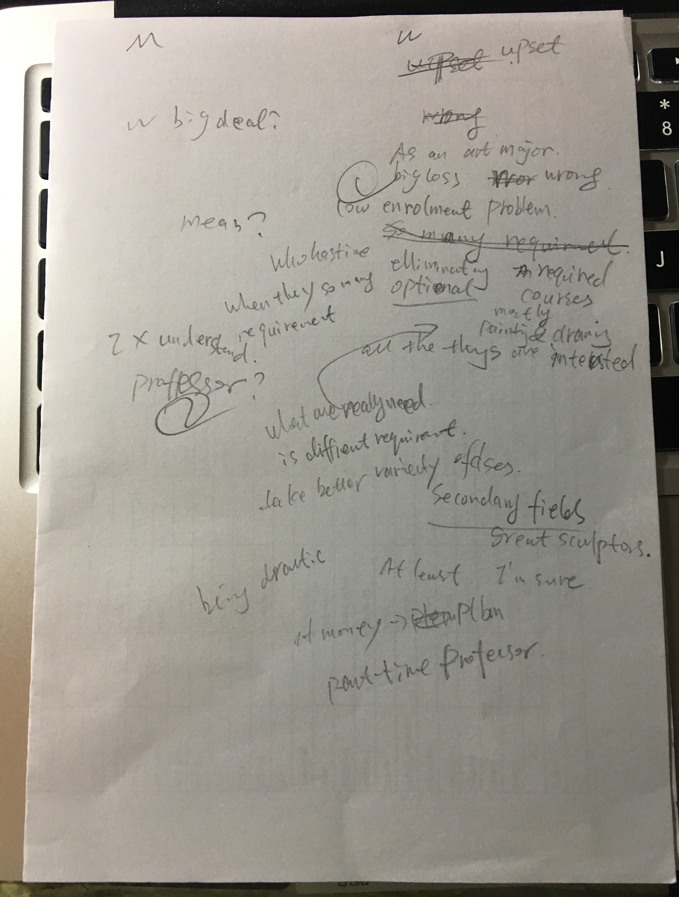    
    
    !!! note "老师反馈"    
    
        because 第一句删掉，只表达后面的很少学生上课即可
        
        Listening 部分，应改为第三人称方式，叙述别人说话的内容
    
### 2018-06-12

??? info "**TPO 8 Music Coming to Cafeterias（自助餐厅将提供音乐）**"

    ==**Reading**==
    
    Mary Dixon, Director of the Student Life Committee, announced yesterday that beginning next semester, university cafeterias will broadcast classical music during mealtimes. （Mary Dixon，学生生活委员会主管，昨天宣布下个学期开始，学校自助餐厅在进餐时间广播经典音乐。）
    
    “Music will foster a more relaxed atmosphere,” said Dixon. ’（“音乐会使环境更轻松，“ Dixon说。）
    
    “Students’ lives are hectic, and mealtimes provide important opportunities to take a break and catch up with friends before moving on to the next class or assignment.” Added Dixon, （”学生们“生活繁忙，并且吃饭时间提供重要的机会休息，也可以在去上下节课或作业之前赶上朋友们。“Dixon接着说，）
    
    “We’re hoping that, if we provide the music, students will unplug their music devices – their walkmans and mp3 players or whatever – and will spend more time talking to each other. （我们希望，如果我们提供音乐，学生们可以拔下他们自己的音乐设备——他们的随身听和mp3播放器或者其他什么——并且花更多时间在与对方聊天上。）
    
    When students have their headphones on, they’re not connecting with each other.”（当学生们戴着自己的耳机的时候，他们不会与互相交谈。）
    
    ==**Listening**==
    
    (man) Have you read this article? Are they serious?（你看到这个文章了么？他们是认真的么？）
    
    (woman) Yeah, I think so. Why?（是的，我想是的。为什么？）
    
    (man) Well, first of all, a lot of kids aren't looking for relaxing breaks at lunch time. （首先，大量的孩子不会在午餐时间寻找休息。）
    
    They like to study while they, especially while they have exams coming up or some assignments they have to get done.（他们那会喜欢学习，尤其当他们将要考试或者有一些作业需要去做的时候。）
    
    (woman) Yeah, that's true.（是的，这是真的。）
    
    (man) And now they won't be able to concentrate. （并且现在他们不能集中注意力。）
    
    This is gonna be very distracting.（他们会非常分心的。）
    
    (woman) Hmmm. Ok, yeah, I see your point.（好的，是，我理解你的意思。）
    
    (man) And second, most students don't like classical music.（并且第二点，大多数学生不喜欢经典音乐。）
    
    (woman) It's certainly not what I listen to.（当然不是我听的。）
    
    (man) So, are people going to stop listening to their own music?（那么，人们会停止听自己的音乐么？）
    
    (woman) No!（不！）
    
    (man) I think people are going to be even more likely to bring their mp3 player, you know, to play their own music and block out the classical stuff.（我认为人们甚至会更可能带着他们自己的MP3播放器，你知道，里面播放他们音乐并且屏蔽经典素材。）
    
    (woman) Yeah, that makes sense.（是的，有道理。）

    ==**Speak**==
    
    `The Director of the Student Life Committee ANNOUNCES THAT he will support classical music during mealtimes for promote a more relexed environment. BECAUSE students are very busy, they have no time to relax. MOREOVER, As they often have their headphones on, they aren't talking to each other. IN THE LISTENING, THE MAN DISAGREES WITH THIS. FIRST OF ALL, a lot of kids aren't looking for relaxing breaks at lunch time, especially while they have exams coming up or some assignments they have to go done. They won't be able to concentrate. This is gonna be very distracting. SECOND most students don't like classical music.They are going to be even more likely to bring their mp3 player to play their own music and block out the classical music stuff.`
    
    NEW WORDS |  NEW WORDS |  NEW WORDS
    ------------ | -------------  | -------------
    Committee 委员会 | broadcast 广播 | foster 促进，培养
    hectic 繁忙的 | catch up with 赶上【同班、同族等其他人的水平】| unplug 拔去……的（电源）插头
    headphones 头戴耳机 | serious 认真的 | take a break 休息一下
    distracting 分心的 | certainly not 【口】当然不 | mealtimes 进餐时间，吃饭时间
    block out 封闭 | make sense 有意义，表述清晰，易于理解
    
    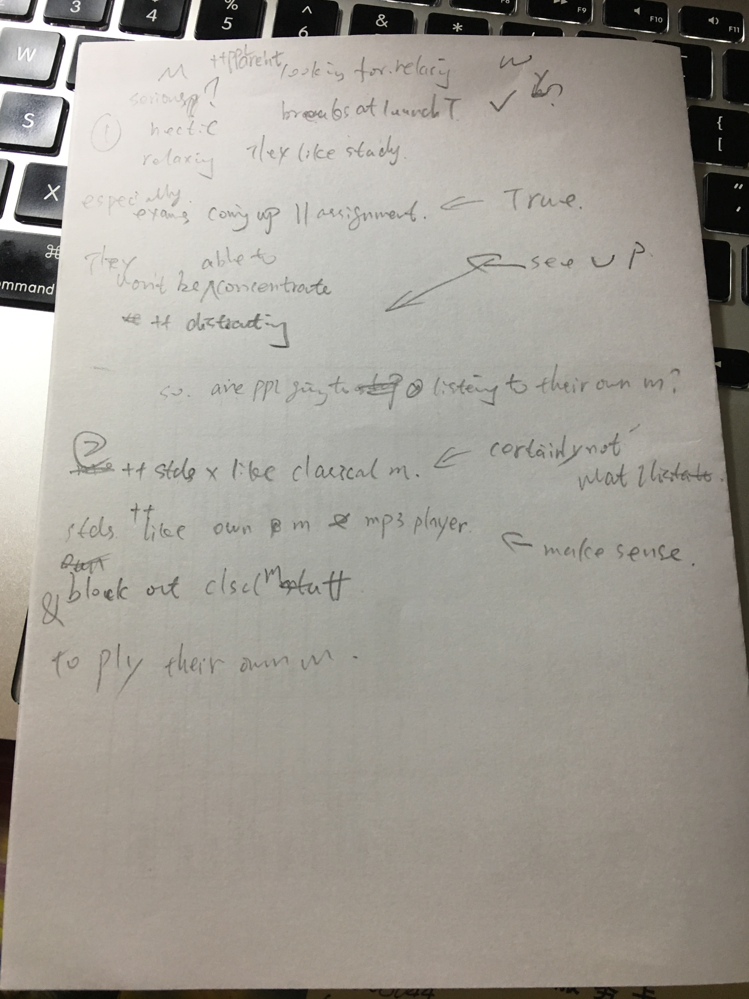    
    
    !!! note "老师反馈"    
    
        for 后跟动名词 => for promoting
        
        because 第一句是删掉，本来就是在说让同学们放松
        
        moreover 后面说是一个现象，应该表达让同学们摘耳机的目的，是为了增加大家的联系
        
### 2018-06-13

??? info "**TPO 9 Required Work Experience（需要的工作经验）**"

    ==**Reading**==
    
    The business studies department at State University will now require all students enrolled in its program to complete one semester of work experience in a local corporation or small business. （州立大学商业研究部门现在需要所有在册学生他们的项目，在本地大公司或者小公司去完成一个学期的工作经验。）
    
    It is felt that students will benefit from this work experience by developing leadership and organizational skills that would not normally be learned in a classroom or campus setting. （感觉学生们将从开发领导力和组织技巧的工作经验中获得好处，这些技能通常无法在课上或者校园环境中学到。）
    
    Furthermore, the relationships (that students establish with the company) (that they work for) many help them to secure permanent employment with that company (once they have completed the program and graduated).（此外，学生们与他们工作的公司建立很多关系帮助他们在完成这个项目和毕业后与公司建立稳定长久的就业。）
    
    ==**Listening**==
    
    (man) Read this announcement?（看到这个公告了吗？）

    (woman) Yeah, and I disagree. I don't think it'll actually help students.（是的，并且我不赞同。我认为它实际上不能帮助学生们。）
    
    (man) Really, why not?（真的，为什么不能？）
    
    (woman) Well, they talked about leadership and organizational skills, but that's not really the kind of work you do. （他们谈到领导能力和组织技巧，但是你真正做的不是那种工作。）
    
    Like my elder brother's had the kind of job they're talking about, and typically you are just there to do the basic tasks like typing or filing stuff, nothing very meaningful.（就像我表哥曾有他们说的那样的工作，并且一般你只在那做基础的任务，如打字或者填写资料，没有非常有意义的工作。）
    
    (man) Oh, so you wouldn't actually learn anything new.（哦，所以你实际上学不到任何新东西。）
    
    (woman) Exactly!（没错！）
    
    (man) I guess I see what you mean. But what about the other point they make?（我想我明白你的意思了。但是关于他们的其他观点怎么看？）
    
    (woman) About this helping us after we graduate? I don't agree.（关于对我们毕业后的帮助？我不赞成。）
    
    (man) How come?（怎么？）
    
    (woman) Well, the problem is that there're lots of other universities in our area that have the same requirement. （这个问题是在我们这个有同样要求的地区有大量其他学校。）
    
    So there're lots of other students at these positions.（因此有大量学生在这些位置上。）
    
    (man) Yeah, I guess I haven't thought of that.（是的，我无法想象。）
    
    (woman) So, even if you take a position like this in a company while you’re still a student, once you graduate the competition for permanent jobs will be impossible. （所以，即使当你仍是个学生的时候你在一个这样的公司的位置上，一旦你毕业竞争长久的工作是不太可能的。）
    
    I mean there just won’t be enough jobs available for all of the business graduates in the city (that will be looking for full-time work).（我的意思在这个要找全职工作的城市无法为所有的商业毕业生获得足够的工作。）
    
    (man) Hmmm, I see what you’re saying.（我明白你说的了。）
    
    ==**Speak**==
    
    `The business studies department ANNOUNCES THAT they will require all students enrolled to accumulate work experience in local company. BECAUSE they believe that the program will help students to develop their leadership and organizational skills. AND students will obtain a secure permanent employment with corporation. IN THE CONVERSATION, THE WOMAN DISAGREES WITH THIS. FIRST OF ALL, the department talked about leardership and organizational skills, but that's not really the kind of work they do. She elder brother said that the students typically are just there to do the basic tasks like typing. So students wouldn't actually learn anything new. WHAT'S MORE, there're lots of other universities in their area that have the same requirement. And there're lots of other students at these positions. The company won't be enough jobs available for all of the business graduates in the city that will be looking for full-time work.
    `
    
    NEW WORDS |  NEW WORDS |  NEW WORDS
    ------------ | -------------  | -------------
    enrol 注册 | corporation 大型公司 | permanent 长久的
    establish 建立【关系或联系】| secure 稳固的 | meaningful 有意义的
    
    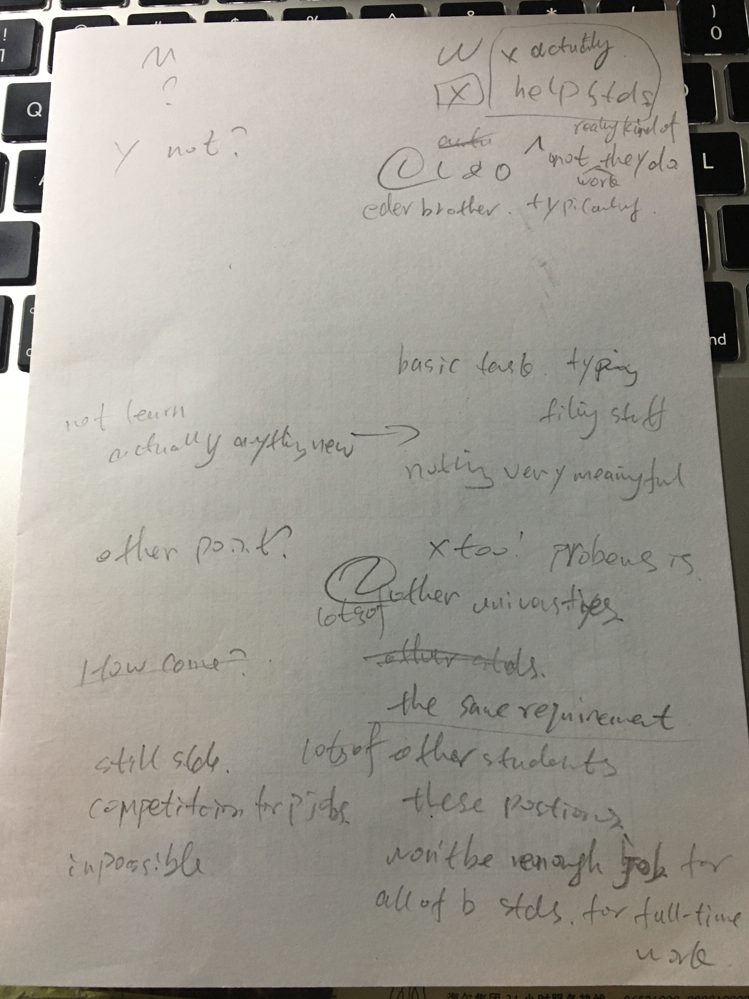    
    
    !!! note "老师反馈"        
    
        permanent 和 typically 读音有误
    
### 2018-06-15

??? info "**TPO 10 Student Art Display（学生艺术展示）**"

    ==**Reading**==
    
    The university is currently considering possible locations on campus for displaying paintings and other artwork by students. （学习当前考虑在校园里可能的位置来展示学生们的画和其他艺术作品。）
    
    I think the lobby at the entrance to the student center would be a great location. （我想大门口的门廊到学生中心是个很好的位置。）
    
    Since many students pass through the student center every day, artwork displayed in the lobby would be viewed by hundreds of people. （许多学生一旦每天经过这里去学生中心，在门廊展示的艺术作品就会被上百名学生看到。）
    
    Also, because the whole front of the building is made of glass windows, the lobby is filled with natural light. （同时，因为大楼的整个前面都是玻璃窗，门廊在自然光下。）
    
    This makes it perfect for displaying artwork, which should have plenty of light to be seen and appreciated.（这对于艺术展览是完美的，可以在大量的光下观看和欣赏。）
    
    Sincerely,（敬上）
    Paul Sands
    
    ==**Listening**==
    
    (man) Mary, you're an art student. What do you think of this letter?（玛丽，你是艺术系学生。你对这个信函怎么看？）

    (woman) I don't like the idea.（我不喜欢这个想法。）
    
    (man) Why not?（为什么不？）
    
    (woman) Well, first of all, his first point about a lot of people passing through the student center, that's true, but..（首先，他的第一点关于好多人通过门廊去学生中心，这是真的，但是……）
    
    (man) But?（但是什么？）
    
    (woman) But it's always crowded with people coming and going. （但是，人们来来去去的很拥挤。）
    
    It's not good for showing artwork. Imagine you're standing there, trying to look at the painting, it's gonna be like a million people walking through. （这对于艺术作品展示并不好。猜想下你站在那，准备看画，然后有上千人走过去。）
    
    People walking in front of you, blocking your view, distracting you.（人们从你前面走过去，挡住了你的视线，使你分心。）
    
    (man) Hmmm. Yeah, I haven't thought of it.（是的，无法想象。）
    
    (woman) You won't be able to appreciate the artwork or get a good look at anything with so much going on, with so many people moving around.（你无法在匆匆路过的时候，在许多人从身边路过的时候欣赏艺术作品或者很好的看到任何。）
    
    (man) Yeah, I see what you mean.（是的，我明白你的意思了。）
    
    (woman) Plus, he's wrong about the windows.（另外，他的另一个问题在于窗户。）
    
    (man) But isn't it true that it's good for art to have lots of light?（但是那不是真的么，有很多光线对于艺术作品很好呀？）
    
    (woman) In a sense, yeah, but that kind of light, all that natural light from windows, that’s actually not good, because if it’s really sunny out it will be way too bright, if it’s cloudy, it will be way too dark.（是的，但是光的种类，从窗户来的自然光，实际上并不好，因为真正的太阳光在窗外那条路特别亮，如果是阴天，那条路就会特暗。）
    
    (man) Oh!（哦！）
    
    (woman) What you want is controlled light, consistent light, the kind you get from electrical light bulb. （你想要是可控的光线，一致的光线，你最好用电灯泡。）
    
    Think about in an art museum. In an art museum, you've got electric lighting and the light is always carefully controlled, always at the same level.（想下在艺术博物馆。在艺术博物馆，你会在点灯下，并且光线始终是被仔细控制的，始终是一个级别。）
    
    ==**Speak**==
    
    `THE UNIVERSITY ANNOUNCES THAT they want to display paintings and artwork at lobby. BECAUSE hundreds of students will view the display when they pass though the student center. MOREOVER the lobby is filled with natural light from glass windows, a plenty of light will help people to appreciate. IN THE CONVERSATION, THE WOMAN DISAGREES WITH THIS. FIRST OF ALL, the lobby is always crowded with people coming and going. It's not good for showing artwork.  And people walking in front of you, blocking your view, distracting you. You won't be able to appreciate the artwork or get a good anything. WHAT'S MORE, the natural light is actually not good, because if it's really sunny out it will be way too bright, if cloudy, it will be way too dark. Think about in an art museum, you'v got electric lighting and the light is always carefully controlled, always at the same level.`
    
    NEW WORDS |  NEW WORDS |  NEW WORDS
    ------------ | -------------  | -------------
    lobby 【公共场所入口处的】门廊，大厅 | entrance 大门口，入口（处），通道 | appreciate 欣赏，赏识
    crowded with 拥挤的 | Imagine 猜想 | distract 使分心
    consistent 一致的 | bright 明亮的 | cloudy 阴天的，多云的
    controlled 限制的，控制的
    
    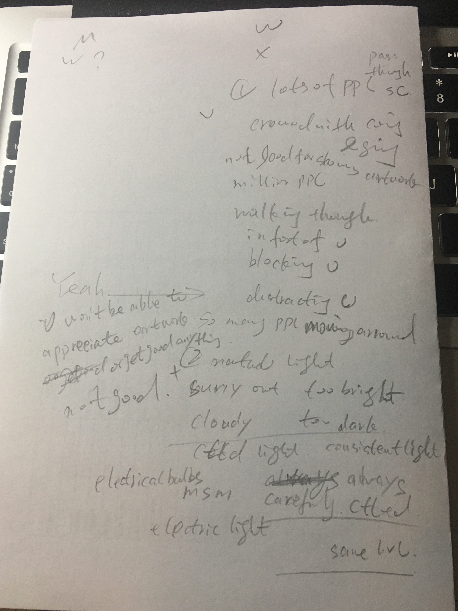    
    
    !!! note "老师反馈"   
        
        听力中的you，需要转化为第三人称
    
### 2018-06-16

??? info "**TPO 11 Housing Renovations Planned（房屋翻修计划）**"

    ==**Reading**==
    
    Over the last ten years, the number of Central College students living on campus in dormitories has decreased by twenty percent. （超过近10年，住在校园宿舍的中央学院学生的数量减少了20%。）
    
    In an effort to counteract the trend, the college has announced a plan to renovate its on-campus housing. （在费力抵消这个趋势时，这个学院宣布一个翻修在校房屋的计划。）
    
    The renovations will take two years, and they will include improvements to the bathrooms, lighting, and heating in the dormitories. （这个翻修持续2年时间，并且包含改善宿舍浴室，灯具和供暖系统。）
    
    “A lot of people are moving off campus because the dorms aren’t in great shape,” explained the college president. （“大量的人们到校外是因为宿舍情况非常不好，”院长解释道。）
    
    “By renovating the dorms, we can make them more appealing than off-campus housing, and more students will choose to remain on campus.”（通过翻修宿舍，我们可以使他们比校外房屋更有吸引力，并且更多的学生会选择留在校园。）
    
    ==**Listening**==
    
    (woman) The college's making a mistake with this new plan.（学院在新计划里反了一个错误。）

    (man) What do you mean? I think it will really help the college to accomplish its goals.（你什么意思？我认为这个真的可以帮助学院完成目标。）
    
    (woman) Don't' be so sure! All that construction, for two years? It's gonna create a lot of noise.（别那么肯定！所有建筑，持续2年？那会制造很多噪音。）
    
    (man) Well, you mean in the beginning, for students still living in the dorms.（你的意思，在一开始，为了学生们仍旧住在宿舍里。）
    
    (woman) Yeah, students who are trying to sleep or do works are constantly going to be disturbed. （是的，试着睡觉或者做作业的学生们是持续不安的。）
    
    So, people will try to get as far away as possible, probably by moving off campus. （所有，人们试着找可能更远的，可能到校外。）
    
    So they are losing even more people!（所以他们会失去甚至更多的人。）
    
    (man) Huh, I haven't thought of that. （我无法想象。）
    
    But still, once all the constructions are over, more people will probably want to live in the dorms, right? （但是仍然，一旦所有建筑翻修结束，更多的人可能会住到宿舍，是不？）
    
    I mean, the living conditions will be so much better.（我的意思，居住环境会变得更好。）
    
    (woman) If they can afford to, do you know how the college is planning on paying for this plan? （如果他们住得起，你知道学院在这个计划中花多少钱吗？）
    
    By raising the cost of campus housing!（通过抬高校园房屋费用！）
    
    (man) Oh! I didn't realize that.（哦！我没有意识到这点。）
    
    (woman) Yeah, so if it’s more expensive why would people want to move back into the dorms if they can rent an apartment for less money?"（是的，如果更贵，人们为什么要搬回宿舍住，如果他们租的公寓更便宜？）
    
    ==**Speak**==
    
    自己写的，实在不会，觉得别扭，看了下原文
    
    `THE College ANNOUNCES THAT they plan to renovate on-campus housing. BECAUSE the number of students living on campus in dormitories was reduced by twenty percent. AND the dorm aren't good shape, the renovation will improve equipments.
    IN THE LISTENING, THE GIRL DISAGREES WITH THIS. FIRST OF ALL, all constructions for two years, that'll create a lot of noise. The students are living in the dorm, they will try to sleep or do works are going to be disturbed. People will get as far away as possible, probably by moving off campus. So they lose even more students. SECOND the college pay for the plan by raising cost of campus housing. It's too expensive why would people want to move back into the dorms if they can rent an apartment for less money. 
    `
    
    NEW WORDS |  NEW WORDS |  NEW WORDS
    ------------ | -------------  | -------------
    renovation 修复，翻新 | decreased 下降的| effort 力气，精力
    counteract 抵消，对抗 | trend 趋势，倾向 | renovate 修复，翻新
    bathrooms 浴室，卫生间 | accomplish 【尤指通过努力】完成 | goal 目标
    constantly 持续不断地 | disturbed 不安的 | the number of 数目，数量
    lighting 照明设备 | heating 供暖系统 | in great shape 情况非常好
    appealing 有吸引力的，有趣的 | rent 租房
    
    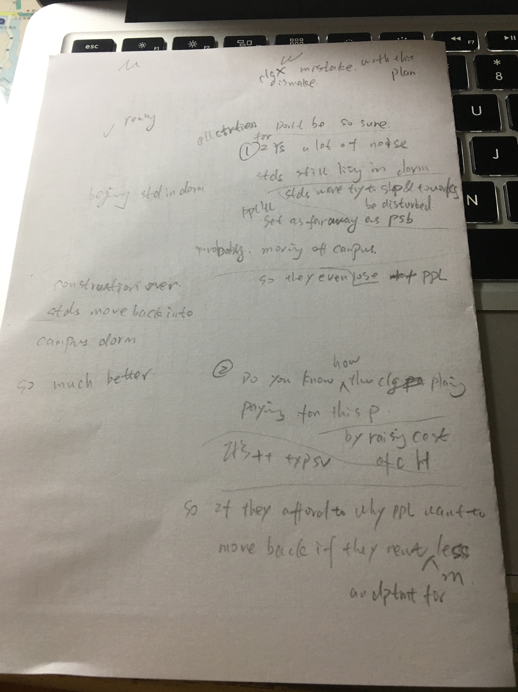    
    
    !!! note "老师反馈"    

        the dorm aren't good shape 改为 the dorm aren't ==in== good shape
        
        improve equipments 改为 attract more students
        
        The students are living in the dorm, they will try to sleep or do works are going to be disturbed. 改为从句  {++Those who try to sleep or do works are going to be disturbed.++}
        
### 2018-06-17

??? info "**TPO 12 College Radio Station to Undergo Major Changes?（学院广播站将经历重大改变）**"

    ==**Reading**==
    
    The university is considering making major changes to the college radio station. （学校正在考虑对学院广播站做大的改动。）
    
    Changes would include an expansion of the station’s broadcasting range, which would allow the radio’s programming to reach nearby towns. （这个改动包含广播站广播范围的扩张，这个范围允许广播节目到达附近小镇。）
    
    One goal of the plan is to attract more students to apply its communications program. （这个计划的一个目标是吸引更多的学生使用它的社交项目。）
    
    Another goal is to provide the university with an extra source of revenue. （另一个目标是提供给学校额外的收入来源。）
    
    University officials expect the enhanced radio station to significantly increase the number of listeners, which will in turn encourage businesses to place commercials on the radio.（学校官方期望增加的广播站可以很大的提高收听人数，将转而鼓励公司在广播里投放地方广告。）
    
    ==**Listening**==
    
    (man) What do you think of the proposal?（你觉得这个建议怎么样？）

    (woman) I think it'll work. I mean, the range of the station now is basically limited to the campus. （我认为这个可行。我的意思，广播站的范围基本上是限制在校园的。）
    
    So it's basically just a few programs mainly for students.（所以基本上只有一小部分节目主要地用于学生。）
    
    (man) Yeah?（是么？）
    
    (woman) Well, if this proposal goes through there will be more programs and it'll give the students more professional experience as they expand the programming for a much larger, you know, real-life audience. （如果这个建议快速实现，会有更多的节目，并且给学生们更专业的经验因为他们扩张为更大的节目，你知道，现实生活观众。）
    
    And stuff like that will give them a better shot at getting a job after they graduate.（并且素材会给他们在毕业后更好的有的放矢找工作。）
    
    (man) Of course.（当然）
    
    (woman) Besides, the whole university will benefit from it.（除此之外，整个学校也能得益于此。）
    
    (man) What do you mean?（你什么意思？）
    
    (woman) Well, you know my friend Tony, right? He told me that the radio station at his university did something like this about five years ago.（我知道我朋友Tony吧？他告诉我，他们学校的广播站做这些事差不多5年了。）
    
    (man) And?（然后？）
    
    (woman) Well, it's a success! They are making a lot of money out of commercials and they are using it to offer more scholarships and to help fund projects to renovate the facilities of other programs.（非常成功！他们从商业广告产出了很多钱，并且他们用这些钱去提供更多的奖学金和援助资金项目去翻修其他节目的设施。）
    
    (man) That sounds really good."（听起来真的很好。）

    ==**Speak**==
    
    `THE UNIVERSITY PROPOSES THAT they are planning to change the college radio station. BECAUSE they want to attract more students to join its communications program. MOREOVER, the university will gain an additional source of revenue. IN THE CONVERSATION, THE WOMAN AGREES WITH THIS. FIRST OF ALL, the rang of the station is basically limited on campus, and it's basically just a few programs for mainly students. There will be more programs and it'll give the students more professional experience as they expand the programing. And stuff like that will give them a better shot at getting a job after graduate. SECOND the whole university will benefit from it. Her friend's university did something about this and succeed. They are making a lot of money of commercials and they are using it to offer more scholarships and to help fund projects to renovate the facilities of other programs.`
    
    NEW WORDS |  NEW WORDS |  NEW WORDS
    ------------ | -------------  | -------------
    undergo 经历，经受，遭受 | expansion 扩大，增加 | revenue 收入
    commercial 商业广告 | facility 设施 | basically 【口】基本上，说白了，说穿了
    
    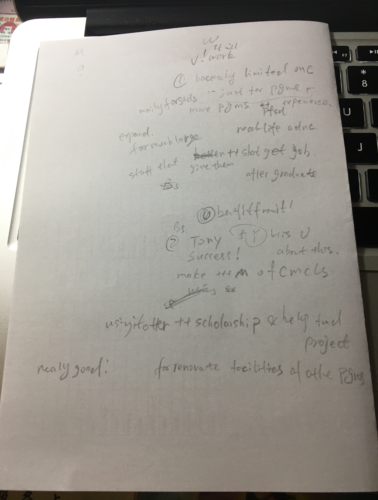    
    
    !!! note "老师反馈"
    
### 2018-06-20

??? info "**TPO 13 New Stadium（新的体育场）**"

    ==**Reading**==
    
    A university official announced plans to spend $2 million to build a new stadium, commenting that a new stadium would help the university achieve its goal of attracting more top students. （一个学校官方声明计划花费两百万建造新的体育场，评论新的体育场能够帮助学校完成吸引更多学生的目标。）
    
    The official also said that, additionally, building a new stadium would allow the university to strengthen its relationship with the town since a new and larger stadium would have the space to seat not only students, parents, and alumni, but members of the local community as well.（官方还称，此外，建造新的体育场能够使得学校与城镇关系更加坚固，因为一个新的大的体育场不仅能够有大的空间提供座椅给学生，家长和校友，而且还可以是本地社区。）
    
    ==**Listening**==
    
    (man) So what do you think of the university's new plan?（那么你怎么看学校的新计划？）

    (woman) Oh, I don't know. I don't think it's gonna work.（哦，我不知道。我认为它不行。）
    
    (man) No?（不行？）
    
    (woman) I mean, I can't imagine top students being too thrilled about some of the conditions on this campus.（我的意思，我无法想象顶尖学生对于校园条件的一些会特别激动。）
    
    (man) What do you mean?（你什么意思？）
    
    (woman) Like, the science laboratory having such old outdated equipment and the library needing more books, and the student center being so small. （科学实验大楼有些老的陈旧的设备，并且图书馆需要更大的书籍，并且学校中心太小。）
    
    I think that the 2 million could be spent in better places if the university is really serious about achieving its goal.（我认为两百万可以花在更好的地方，如果学校完成目标真的重要。）
    
    (man) OK. But what about the other reason for building the stadium? （好的。但是对于建造体育场的其他原因怎么看？）
    
    I mean right now we have so little contact with the town.（我的意思现在我们与小镇没有任何联系。）
    
    (woman) Yeah, but this won't help relations. （是的，但是这个不能帮助联系。）
    
    Look, people from town hardly ever come to the games because our teams always lose. （人们任何时候从不从小镇来学校玩，因为我们的团队经常输。）
    
    And they're not suddenly going to improve over night. （并且他们没有突然的整夜的去改善。）
    
    Besides, adding seats won't make a difference. （除此之外，添加座椅并没有什么不同。）
    
    I mean, if people from town didn't come before, they won’t come now just because the place is bigger.（我的意思，如果来自小镇的人们以前没来过，他们现在也不会仅仅因为地方更大了而来。）

    ==**Speak**==
    
    `THE UNIVERSITY ANNOUNCES THAT they plan to spend $2 million to build a new stadium. BECAUSE they want to achieve its goal by attracting more top students. MOREOVER they hope to strengthen the relationship between the university and the town. IN THE LISTENING, THE WOMAN DISAGREES WITH THIS. FIRST OF ALL, the top students aren't too thrilled. The science laboratory having such old outdated equipment and library needing more books, and student center being to small. She thinks that the $2 million could be spent in better places if the university is really serious about achieving its goal. SECOND adding seats won't make a difference. The people from town hardly ever come, so they won't come now just because the place is bigger.`
    
    NEW WORDS |  NEW WORDS |  NEW WORDS
    ------------ | -------------  | -------------
    stadium 体育场 | strengthen 使更坚固 | alumni 校友
    thrilled 非常激动的 | laboratory 实验大楼 | outdated 过时的，陈旧的
    serious 重要的 | hardly 几乎不 | ever 【疑问，否定】在任何时候
    
    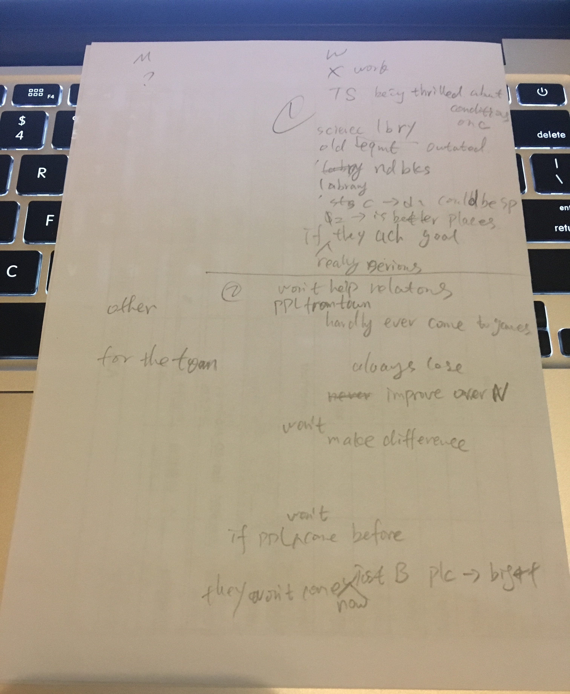    
    
    !!! note "老师反馈"
    
### 2018-06-21

??? info "**TPO 14 University Should Allow Eating in Class（学校应该允许在教室饮食）**"

    ==**Reading**==
    
    Currently, there is a university-wide policy that prohibits eating in the classroom. （当前，学校范围有一个禁止在教室饮食的政策。）
    
    I disagree with this policy. （我不认同这个政策。）
    
    I think students should be allowed to eat in class. （我认为应该被允许在教室饮食。）
    
    This change would be good for two reasons. （这个改变很好，因为两个原因。）
    
    For one thing, if students were permitted to eat, they would be able to concentrate better, because students often get hungry during long classes, and hunger makes it difficult to concentrate. （首先，如果学生被允许饮食，他们能够更专注，因为学生们在上大课期间常常感到饿，并且饥饿很难使人很难集中精力。）
    
    Also, if food were allowed in classroom, it would be possible for us to have in-class parties on the last day of class – with snack foods and beverages – to celebrate the end of each semester.（其次，如果食物被允许带入教室，它对于我们可能有课程最后一天的教室聚会——有点心和饮料——来庆祝每个学期的结束。）
    
    Sincerely,（敬上）
    
    Nancy Myers
    
    ==**Listening**==
    
    (woman) Did you see this letter, Jen?（Jen，你看到这个信函了吗？）

    (man) Yeah.（是的。）
    
    (woman) Be kind of nice to do that, huh?（做的很好，是吧？）
    
    (man) No, actually, I don't think it's a good idea.（不，实际上，我认为这不是一个好主意。）
    
    (woman) Why not?（为什么不？）
    
    (man) Well, like the part about how it'll help students concentrate, I mean, maybe a little snack will help the person who's eating it, but, the trouble is that it makes it hard for everyone else to concentrate cause they have to listen to someone munching on chips, or biting into an apple, or crinkling paper wrappers.（像如何帮助学生专注这块，我的意思，也许没有小吃能帮吃的人，但是，麻烦是它使得其他的每个人难以专注，导致他们必须去听一些人出声的嚼薯条，咬苹果，或者揉纸袋。）
    
    (woman) I guess it can be kind of disruptive.（我觉得它是一直扰乱性的。）
    
    (man) Yeah! It will interfere with everyone's concentration. You wouldn't be able to pay attention with all the noises going on.（是的。它会干扰每个人的注意力。你不能在一直有噪音的情况下专心做事。）
    
    (woman) OK, I guess I will have to agree with you on that, but what about her other reason? （好的，我觉得我不能不同意你的看法，但是她的另一个原因呢？）

    It would be nice to be able to have some fun at the end of the semester, right? （那个能在期末有一些乐趣，是不是？）

    (man) No, there's a problem with that, too.（不，那个也有问题。）
    
    (woman) Why?（为什么？）
    
    (man) Well, I don’t think it’s appropriate to use class time for that kind of thing. （我认为对于这种事使用课堂时间是不合适的。）
    
    I mean, the last class is usually pretty important, that’s when we do a lot of reviewing for final exams.（我的意思，最后一课通常是相当重要的，那时我们要做为期末考试做大量的复习。）
    
    (woman) True!（确实！）
    
    (man) If we use that time for that, we probably wouldn't have time to do as much reviewing, which means we wouldn't be as well prepared for exams.（如果我们使用这个时间做那个，我们也许没有足够的复习时间，意思是我们不能很好的准备考试。）
    
    (woman) Yeah, I haven’t thought of that.（是的，我无法想象。）
    
    ==**Speak**==
    
    `A STUDENT DISAGREES WITH THAT the university prohibit students eating in classroom. BECAUSE students often hungry during long class. AND they can have a party with snack foods and beverages to celebrate the end of semester. IN THE CONVERSATION, THE MAN DISAGREES WITH THIS. FIRST OF ALL, it will interfere with everyone's concentrate. Peoples wouldn't be able to pay attention with all the noises going on. The trouble is that it make it hard of everyone else to concentrate cause they have to listen to someone munching on chips, or biting into an apple, or crinkling paper wrappers. SECOND, it's appropriate to use class time for that kind of thing. Because the last class is usually pretty important, if they use that time for that, they probably wouldn't have time to do so much reviewing  for final exams.`
    
    NEW WORDS |  NEW WORDS |  NEW WORDS
    ------------ | -------------  | -------------
    prohibit 禁止 | permit to 允许 | snack 小吃，点心
    beverage 【正式】饮料 | celebrate 庆祝 | munch 出声地嚼
    bit 咬 | crinke 使起皱 | wrapper 包装纸
    disruptive 扰乱性的 | interfere with  sb. 干扰 | appropriate to 恰当的，合适的
    pay attention （对某人/某事）注意
    
    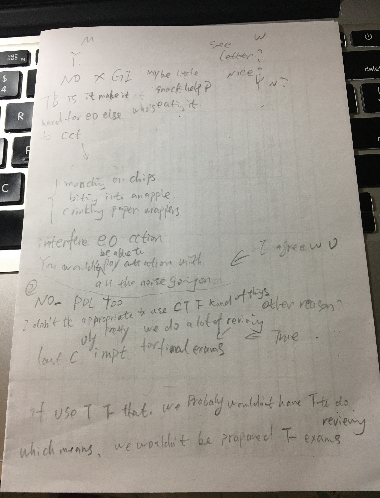    
    
    !!! note "老师反馈"
    
### 2018-06-22

??? info "**TPO 15 University Should Pave Running Trails（学校要铺设跑步小路）**"

    ==**Reading**==
    
    The university has about three miles of unpaved dirt running trails that pass through the forest near campus. （学校有三英里未铺设的土路，这条路在校园附近通向森林。）
    
    I think these trails should be paved with cement. （我认为这些路应该铺设为水泥路面。）
    
    One reason for paving the trails would be to increase their safety. （对于铺路的一个原因是能够增加路面安全。）
    
    When it rains, the dirt turns to mud and becomes very slippery, so the runners who use them can slip and fall. （下雨的时候，那些土会变成泥，并且会变得很滑，所以在这条路上跑步的人们会滑到。）
    
    Pavement would solve this problem. （铺设的路面可以解决这个问题。）
    
    Also, paving would make the trails look nicer, which would encourage students to use them. （同时，铺设可以让这条路看起来更好，它能够鼓励学生们使用。）
    
    Bumps in the trail would be smoothed out and weeds would be paved over, making the trail more attractive to runners.（小路上凸起的部分会被修平，并且野草也会被铲除，使得这条路更加吸引跑步者。）

    
    ==**Listening**==
    
    (woman) Hey, Ted, you're a runner. Did you see this letter in the paper?（Ted，你是跑步者吗？你看到这个信函了吗？）

    (man) Yeah, I did, and I use those.（是的，我是，并且我看到了。）
    
    (woman) And?（然后？）
    
    (man) I think it's a terrible idea.（我认为这是个很糟糕的建议。）
    
    (woman) How come?（怎么？）
    
    (man) Well, she really hasn't thought it through. （她真的没有想过。）
    
    Like, the thing about making them safer, what's she's not thinking about is the long-term consequence of running on a hard surface.（这个事能使他们更安全，她没有想这是一个长期在硬的路面跑步的后果是什么。）
    
    (woman) What do you mean?（你什么意思？）
    
    (man) I mean, it's not good for you. It's too hard on your bones and joints. （我的意思，这事对你不好。对你的骨骼和关节来说太硬。）
    
     you run repeatedly on hard surface, it can lead to injuries or, that's what I've been taught anyway, it's better to run on a soft surface. （你在硬的路面跑圈，路面会导致你受伤或者，至少我被教育过，最好在一个软的平面上跑步。）
     
     It does less damage to your body.（那样对你的身体伤害更小。）
    
    (woman) Oh, I wasn't aware of that.（哦，我没有考虑到这块。）
    
    (man) Yeah, so actually it wouldn't be safer. And her second point…（是的，实际上并不安全。并且第二点……）
    
    (woman) About changing the way they look?（关于他们看到的路面改变？）
    
    (man) Yeah, I don't think people will like it.（是的，我认为人们不会喜欢的。）
    
    (woman) So they'd use them less?（所以他们会更少使用它？）
    
    (man) Yeah, I mean, one of the main reasons people enjoy them now was it’s a way of taking a break from the rest of the campus, from buildings and streets and stuff. （是的，我的意思，一个主要的原因人们享有它现在是一条从大楼和街道之类到校园的休闲小路）
    
    It’s, you know, a chance like you’re out in the nature.（你知道的，一个让你远离进入大自然的机会。）
    
    (woman) Oh, so you wouldn't bet that effect anymore.（所以你能打赌不再会有效果。）
    
    (man) Right! It’d be just like you’re on a regular street or sidewalk. It wouldn't be as relaxing.（是的！你仅在一条普通的街道或者人行道。它不能使人放松。）
    
    ==**Speak**==
    
    `A STUDENT PROPOSES THAT the university should pave about three miles trails which pass through the forest near campus. BECAUSE pavement would increase their safety. MOREOVER it seems better and would encourage students to use. IN THE LISTENING THE MAN DISAGREES WITH THIS. FIRST OF ALL, the pavement with cement is too hard on people's bones and joints. It is can lead to injuries that is the long-term consequence of running on a hard surface, it's better to run on a soft surface. SECOND people wouldn't like about changed way. They enjoy them now it's a way of taking a break from the rest of the campus, from buildings and streets and stuff. This a chance like you're out in the nature.`
    
    NEW WORDS |  NEW WORDS |  NEW WORDS
    ------------ | -------------  | -------------
    Pave 铺路 | Trail 【乡间或森林里的】小路，小径 | dirt 灰尘
    cement 水泥 | safety 安全 | mud 泥
    slippery 滑溜的 | Pavement 路面，铺过的表面 | Bump 隆起之处
    smooth 使平滑 | weed 杂草 | terrible 很糟的，极差的
    consequence of 后果 | bone 骨头 | joint 关节
    injury 【身体上的】伤，损害 | and stuff 【口，非正式】之类的东西
    anymore 不再 | sidewalk 人行道 | relaxing 使人放松的，轻松的
    
        
    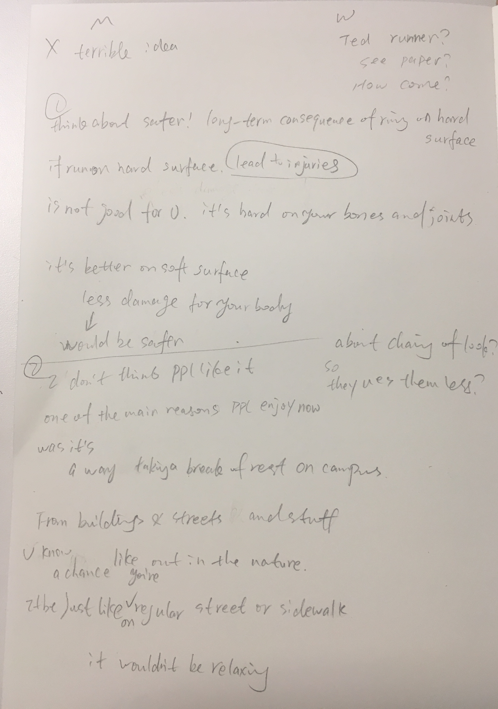    
    
    !!! note "老师反馈"